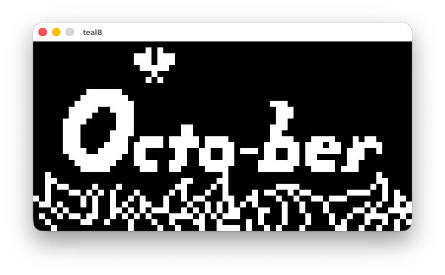

[![Contributors][contributors-shield]][contributors-url]
[![Forks][forks-shield]][forks-url]
[![Stargazers][stars-shield]][stars-url]
[![Issues][issues-shield]][issues-url]
[![Pull Requests][pulls-shield]][pulls-url]
[![GitHub Created At][created-shield]][created-url]
[![GitHub Code Size][size-shield]][size-url]
[![MIT License][license-shield]][license-url]


<br />
<div align="center">

<a href="https://github.com/jacob-thompson/teal8">

</a>

<h1 align="center">teal8</h3>

<p align="center">
CHIP-8 interpreter written in pure C.
<br />
</p>

</div>

## about 



[CHIP-8](https://en.wikipedia.org/wiki/CHIP-8) is an interpreted programming language developed by Joseph Weisbecker. [teal8](https://jacob-thompson.github.io/portfolio/teal8/) is an interpreter for running CHIP-8 ROMs.

## prerequisites

* [make](https://www.gnu.org/software/make/) is used for compilation.
* [SDL2](https://www.libsdl.org/) is used to render the graphics and handle the input.
* [curl](https://curl.se/) is used to pull data about ROMs from the [chip-8-database](https://github.com/chip-8/chip-8-database).
* [openSSL](https://www.openssl.org/) is used to get SHA1 hashes of ROMs.

#### macOS

```bash
brew install make sdl2 curl openssl
```

#### Ubuntu

```bash
sudo apt-get install make libsdl2-dev libcurl4-openssl-dev libssl-dev
```

#### Arch Linux

```bash
sudo pacman -S make sdl2 curl openssl
```

## compile

```bash
git clone https://github.com/jacob-thompson/teal8.git
cd teal8
make
```

The `teal8` binary will be in `bin/`.

You can add the binary to your PATH:

```bash
export PATH="path/to/teal8/bin:$PATH"
```

## usage

```bash
teal8 [-d|--debug] [-m|--mute] [-f|--force] [-i|--ips <number>] <rom>
```

You can omit the rom's file extension:

```bash
teal8 roms/rps
```

The following flags are available:

```
--mute (-m)             Mute sound
--force (-f)            Force run ROM even if not recognized
--ips <number> (-i)     Set instructions per second (default: 1000)
```

## controls

The controls are mapped to the following keys:

```
1 2 3 4
Q W E R
A S D F
Z X C V
```

## help

```bash
teal8 --help
```

## special thanks

- [tobiasvl](https://tobiasvl.github.io/blog/write-a-chip-8-emulator/)
- [Timendus](https://github.com/Timendus/chip8-test-suite)
- [johnearnest](https://johnearnest.github.io/chip8Archive/)

[contributors-shield]: https://img.shields.io/github/contributors/jacob-thompson/teal8.svg?style=flat
[contributors-url]: https://github.com/jacob-thompson/teal8/graphs/contributors
[forks-shield]: https://img.shields.io/github/forks/jacob-thompson/teal8.svg?style=flat
[forks-url]: https://github.com/jacob-thompson/teal8/network/members
[stars-shield]: https://img.shields.io/github/stars/jacob-thompson/teal8.svg?style=flat
[stars-url]: https://github.com/jacob-thompson/teal8/stargazers
[issues-shield]: https://img.shields.io/github/issues/jacob-thompson/teal8.svg?style=flat
[issues-url]: https://github.com/jacob-thompson/teal8/issues
[pulls-shield]: https://img.shields.io/github/issues-pr/jacob-thompson/teal8
[pulls-url]: https://github.com/jacob-thompson/teal8/pulls
[created-shield]: https://img.shields.io/github/created-at/jacob-thompson/teal8
[created-url]: https://github.com/jacob-thompson/teal8
[size-shield]: https://img.shields.io/github/languages/code-size/jacob-thompson/teal8
[size-url]: https://github.com/jacob-thompson/teal8
[license-shield]: https://img.shields.io/github/license/jacob-thompson/teal8.svg?style=flat
[license-url]: LICENSE
